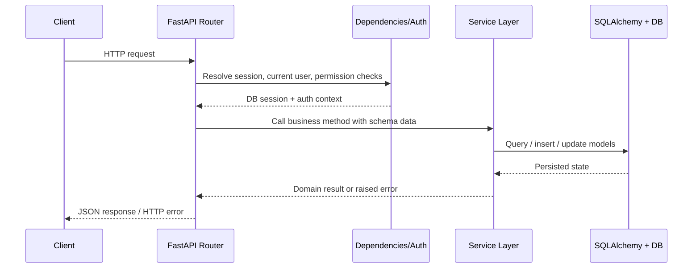
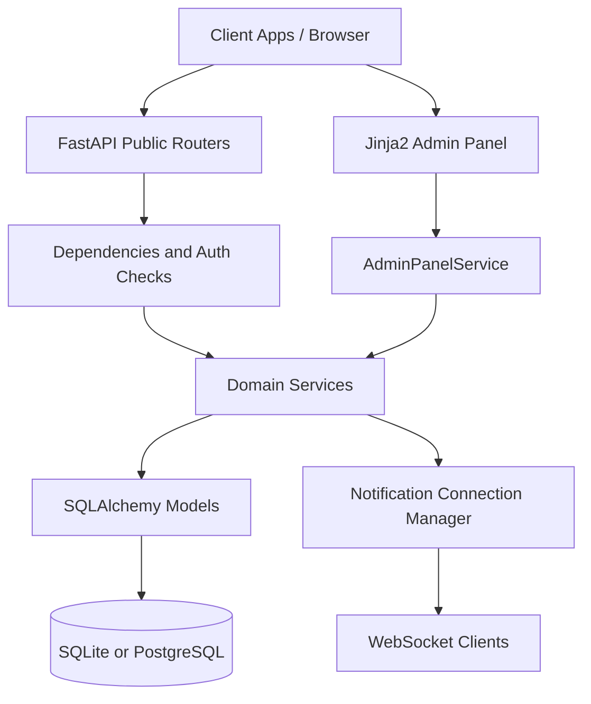

# BACKEND_ANALYSIS

This document is based only on the backend source files present in this repository. It reflects the code as implemented under `app/`, `alembic/`, `requirements.txt`, `Dockerfile`, `docker-compose.yml`, `alembic.ini`, and `.env.example`.

## 1. Backend Overview

| Item | Analysis |
| --- | --- |
| What this backend does | It provides an HR management backend with a public JSON API under `/api/v1`, a server-rendered internal admin dashboard under `/admin`, and a database schema managed with Alembic. |
| Main responsibilities | System bootstrap and installation, authentication, organization structure, employee management, permission management, workflow-based requests, notifications, attendance tracking, team performance tracking, and dashboard aggregation. |
| Architecture style | The code is closest to a modular layered monolith. FastAPI routers act as controllers, `dependencies.py` files provide DI/auth/session helpers, `service.py` files hold business logic, Pydantic schemas define request/response contracts, and SQLAlchemy models define persistence. |
| Notable architectural trait | It is not strict MVC or Clean Architecture. There is no repository layer, domain layer, or use-case interface layer. Services talk directly to SQLAlchemy sessions and models. |
| Secondary interface | In addition to the public API, the codebase contains an internal Jinja2-based admin panel that reuses the same services and database. |

### Main business domains implemented

- `setup`: first-install bootstrap and wizard state
- `auth`: login, current user, password change
- `organization`: departments, teams, job titles
- `employees`: employee profiles plus linked user accounts
- `permissions`: permission catalog and job-title permission assignment
- `requests`: configurable request types, fields, workflow steps, approvals
- `notifications`: internal notifications plus websocket delivery
- `attendance`: scan ingestion, daily summaries, monthly reports
- `performance`: team objectives and daily performance submission
- `dashboard`: read-only aggregates across employees, requests, attendance, and performance
- `admin_panel`: internal super-admin-only dashboard and setup wizard

## 2. Tech Stack

| Category | Technology | Evidence in code |
| --- | --- | --- |
| Language | Python | Entire backend is Python-based |
| Python runtime | Python 3.12 | `Dockerfile` uses `python:3.12-slim` |
| Web framework | FastAPI `0.115.6` | `requirements.txt`, `app/main.py` |
| ASGI server | Uvicorn `0.32.1` | `requirements.txt`, `app/server.py`, `docker-compose.yml` |
| ORM | SQLAlchemy `2.0.36` | `requirements.txt`, `app/core/database.py`, model files |
| Migrations | Alembic `1.14.0` | `requirements.txt`, `alembic/` |
| Settings/config | `pydantic-settings` `2.7.0` | `app/core/config.py` |
| Templating | Jinja2 `3.1.6` | `requirements.txt`, `app/apps/admin_panel/router.py` |
| Form parsing | `python-multipart` `0.0.20` | `requirements.txt`, admin form handling |
| Database backends | SQLite by default, PostgreSQL optionally | `.env.example`, `app/core/config.py`, `docker-compose.yml` |
| PostgreSQL driver | `psycopg[binary]` `3.2.3` | `requirements.txt`, DSN normalization in `config.py` |
| Password hashing | Custom `hashlib.scrypt` wrapper | `app/core/security.py` |
| JWT | Custom HS256 implementation | `app/core/security.py` |
| Realtime transport | FastAPI WebSocket | `app/apps/notifications/router.py`, `realtime.py` |
| Containerization | Docker and Docker Compose | `Dockerfile`, `docker-compose.yml` |

### Important libraries

| Library | Why it matters here |
| --- | --- |
| `fastapi` | HTTP routing, dependency injection, OpenAPI docs, WebSocket support |
| `uvicorn[standard]` | ASGI runtime for local and container execution |
| `sqlalchemy` | Engine, sessions, queries, models |
| `alembic` | Schema migrations |
| `psycopg[binary]` | PostgreSQL connectivity |
| `pydantic-settings` | Environment-driven config loading and validation |
| `jinja2` | Internal admin dashboard templates |
| `python-multipart` | Admin form submission parsing |

## 3. Project Structure

### High-level structure

```text
backend_n/
|- app/
|  |- main.py
|  |- server.py
|  |- core/
|  |- db/
|  |- shared/
|  |- apps/
|  |- templates/admin/
|  \- static/admin/
|- alembic/
|  |- env.py
|  \- versions/
|- Dockerfile
|- docker-compose.yml
|- requirements.txt
|- alembic.ini
|- README.md
|- .env.example
\- hr_management.db
```

### Important folders and files

| Path | Purpose |
| --- | --- |
| `app/main.py` | Creates the FastAPI app, registers middleware, mounts static files, and includes routers |
| `app/server.py` | Production-oriented Uvicorn entry point |
| `app/core/config.py` | Central settings object loaded from `.env` |
| `app/core/database.py` | SQLAlchemy base class, engine creation, session factory |
| `app/core/security.py` | Password hashing, JWT creation/validation, bearer extraction, temp password generation |
| `app/core/dependencies.py` | Shared DI helpers for settings and DB session |
| `app/db/base.py` | Imports model modules so Alembic can see all metadata |
| `app/shared/constants.py` | OpenAPI tag definitions |
| `app/shared/responses.py` | Shared response schemas for health/module-status patterns |
| `app/apps/router.py` | Aggregates public API routers |
| `app/apps/*/router.py` | HTTP route layer for each module |
| `app/apps/*/service.py` | Business logic layer for each module |
| `app/apps/*/schemas.py` | Pydantic request/response contracts |
| `app/apps/*/models.py` | SQLAlchemy persistence models for each domain |
| `app/apps/admin_panel/router.py` | Internal HTML admin interface routes |
| `app/apps/admin_panel/service.py` | Internal dashboard service facade over the domain services |
| `app/templates/admin/` | Jinja2 templates for admin pages |
| `app/static/admin/` | CSS and JS used by the admin panel |
| `alembic/env.py` | Migration runtime configuration |
| `alembic/versions/` | Migration history |
| `docker-compose.yml` | Local container setup with backend + PostgreSQL |
| `Dockerfile` | Container image build for the backend |
| `.env.example` | Reference environment variables |

### Module layout pattern

Most business modules follow the same pattern:

| File | Role |
| --- | --- |
| `router.py` | Endpoint definitions and HTTP error mapping |
| `dependencies.py` | Service injection helpers, auth/permission dependencies |
| `service.py` | Business rules and DB operations |
| `schemas.py` | Request validation and response serialization |
| `models.py` | SQLAlchemy tables and enums |

### Placeholder modules

| File | Current state |
| --- | --- |
| `app/apps/users/service.py` | Placeholder `UsersService` with no business logic |
| `app/apps/auth/models.py` | Placeholder exporting `Base` only |
| `app/apps/dashboard/models.py` | Placeholder exporting `Base` only |

## 4. Entry Point and Runtime Initialization

### Application start

| File | Responsibility |
| --- | --- |
| `app/main.py` | Creates `FastAPI(...)`, configures CORS, registers `/` and `/health`, mounts `/static`, includes `/admin` routes and `/api/v1` API routes |
| `app/server.py` | Calls `uvicorn.run("app.main:app", ...)` with proxy-aware settings |

### Initialization flow

1. `settings = get_settings()` loads validated environment config from `.env`.
2. `app = FastAPI(...)` is created with title, version, description, debug flag, and OpenAPI tags.
3. If `CORS_ALLOW_ORIGINS` is non-empty, `CORSMiddleware` is added with explicit origins only.
4. Root endpoints `/` and `/health` are registered.
5. Static files are mounted from `app/static` at `/static`.
6. `admin_router` is mounted directly under `/admin`.
7. `api_router` is included under `settings.api_v1_prefix` which defaults to `/api/v1`.

### Runtime entry options

| Context | How it starts |
| --- | --- |
| Local manual run | `uvicorn app.main:app --reload` |
| Python module entry | `python -m app.server` |
| Docker image | `CMD ["python", "-m", "app.server"]` |
| Docker Compose | Overrides command to `uvicorn app.main:app --host 0.0.0.0 --port 8000` |

### Non-API routes

| Path | Purpose |
| --- | --- |
| `/` | Root health-like response |
| `/health` | Health endpoint used by Docker healthcheck |
| `/static/*` | Static assets for the admin panel |
| `/admin/*` | Internal server-rendered super-admin dashboard |

## 5. API Layer

### Routing composition

All public routers are included through `app/apps/router.py` and exposed under `/api/v1` by default.

Included modules:

- `setup`
- `auth`
- `users`
- `organization`
- `employees`
- `notifications`
- `permissions`
- `requests`
- `attendance`
- `performance`
- `dashboard`

### Controller pattern in this codebase

- There is no dedicated `controllers/` folder.
- FastAPI router functions are the controller layer.
- Routers validate input through Pydantic schemas, call services, and translate service exceptions into HTTP responses.
- Business rules live primarily in `service.py`, not in the router functions.

### Public API modules

| Module | Base path | Main service | What it does | Access model |
| --- | --- | --- | --- | --- |
| Setup | `/api/v1/setup` | `SetupService` | Bootstrap super admin and report installation state | Open endpoints |
| Auth | `/api/v1/auth` | `AuthService` | Login, current user, password change | Login open, others require bearer token |
| Users | `/api/v1/users` | `UsersService` | Placeholder status endpoint only | Open status endpoint |
| Organization | `/api/v1/organization` | `OrganizationService` | CRUD-like management of departments, teams, job titles | Permission-based |
| Employees | `/api/v1/employees` | `EmployeesService` | Employee profiles plus linked user accounts | Permission-based |
| Permissions | `/api/v1/permissions` | `PermissionsService` | Permission catalog and job-title assignment | Permission-based |
| Notifications | `/api/v1/notifications` | `NotificationsService` | User-scoped notification read/update plus websocket stream | Authenticated user scope |
| Requests | `/api/v1/requests` | `RequestsService` | Dynamic request configuration and workflow processing | Permission-based plus service-level visibility rules |
| Attendance | `/api/v1/attendance` | `AttendanceService` | Scan ingestion, daily summaries, monthly reports | Permission-based |
| Performance | `/api/v1/performance` | `PerformanceService` | Team objectives and daily performance | Permission-based plus leader checks |
| Dashboard | `/api/v1/dashboard` | `DashboardService` | Read-only aggregates | Permission-based plus scope filtering |

### Main public endpoints

All paths below include the `/api/v1` prefix.

#### Setup

| Method | Path | Purpose | Access |
| --- | --- | --- | --- |
| `GET` | `/setup/status` | Return installation/bootstrap status | Open |
| `POST` | `/setup/initialize` | Create bootstrap super admin from env vars | Open, one-time bootstrap |

#### Auth

| Method | Path | Purpose | Access |
| --- | --- | --- | --- |
| `POST` | `/auth/login` | Authenticate by matricule/password and return JWT | Open |
| `GET` | `/auth/me` | Return current authenticated user plus effective permissions | Bearer token |
| `POST` | `/auth/change-password` | Change current user password | Bearer token |

#### Users

| Method | Path | Purpose | Access |
| --- | --- | --- | --- |
| `GET` | `/users/status` | Module availability placeholder | Open |

#### Organization

| Method | Path | Purpose | Access |
| --- | --- | --- | --- |
| `POST` | `/organization/departments` | Create department | `organization.create` |
| `GET` | `/organization/departments` | List departments | `organization.read` |
| `GET` | `/organization/departments/{department_id}` | Get department by id | `organization.read` |
| `PATCH` | `/organization/departments/{department_id}` | Update department | `organization.update` |
| `POST` | `/organization/departments/{department_id}/deactivate` | Soft-deactivate department | `organization.deactivate` |
| `POST` | `/organization/teams` | Create team | `organization.create` |
| `GET` | `/organization/teams` | List teams | `organization.read` |
| `GET` | `/organization/teams/{team_id}` | Get team by id | `organization.read` |
| `PATCH` | `/organization/teams/{team_id}` | Update team | `organization.update` |
| `POST` | `/organization/teams/{team_id}/deactivate` | Soft-deactivate team | `organization.deactivate` |
| `POST` | `/organization/job-titles` | Create job title | `organization.create` |
| `GET` | `/organization/job-titles` | List job titles | `organization.read` |
| `GET` | `/organization/job-titles/{job_title_id}` | Get job title by id | `organization.read` |
| `PATCH` | `/organization/job-titles/{job_title_id}` | Update job title | `organization.update` |
| `POST` | `/organization/job-titles/{job_title_id}/deactivate` | Soft-deactivate job title | `organization.deactivate` |

#### Employees

| Method | Path | Purpose | Access |
| --- | --- | --- | --- |
| `POST` | `/employees` | Create employee and linked user account | `employees.create` |
| `GET` | `/employees` | List employees with filters | `employees.read` |
| `GET` | `/employees/{employee_id}` | Get employee by id | `employees.read` |
| `PATCH` | `/employees/{employee_id}` | Update employee and linked user data | `employees.update` |

#### Permissions

| Method | Path | Purpose | Access |
| --- | --- | --- | --- |
| `POST` | `/permissions` | Create permission catalog record | `permissions.create` |
| `GET` | `/permissions` | List permissions | `permissions.read` |
| `GET` | `/permissions/{permission_id}` | Get permission by id | `permissions.read` |
| `PATCH` | `/permissions/{permission_id}` | Update permission | `permissions.update` |
| `PUT` | `/permissions/job-titles/{job_title_id}` | Replace permissions assigned to a job title | `permissions.assign` |
| `GET` | `/permissions/job-titles/{job_title_id}` | View job-title permission assignment | `permissions.read` |

#### Requests

| Method | Path | Purpose | Access |
| --- | --- | --- | --- |
| `POST` | `/requests/types` | Create request type | `requests.manage_types` |
| `GET` | `/requests/types` | List request types | `requests.read_all` |
| `GET` | `/requests/types/{request_type_id}` | Get request type by id | `requests.read_all` |
| `PATCH` | `/requests/types/{request_type_id}` | Update request type | `requests.manage_types` |
| `POST` | `/requests/types/{request_type_id}/fields` | Add request field definition | `requests.manage_types` |
| `GET` | `/requests/types/{request_type_id}/fields` | List fields for a request type | `requests.read_all` |
| `GET` | `/requests/fields/{request_field_id}` | Get request field definition | `requests.read_all` |
| `PATCH` | `/requests/fields/{request_field_id}` | Update request field definition | `requests.manage_types` |
| `POST` | `/requests/types/{request_type_id}/workflow-steps` | Add workflow step definition | `requests.manage_types` |
| `GET` | `/requests/types/{request_type_id}/workflow-steps` | List workflow steps for a type | `requests.read_all` |
| `GET` | `/requests/workflow-steps/{step_id}` | Get workflow step by id | `requests.read_all` |
| `PATCH` | `/requests/workflow-steps/{step_id}` | Update workflow step | `requests.manage_types` |
| `POST` | `/requests` | Submit workflow request | `requests.submit` |
| `GET` | `/requests` | List visible requests | Authenticated plus visibility rules |
| `GET` | `/requests/pending-approvals` | List requests awaiting current user approval | Authenticated approver scope |
| `GET` | `/requests/my-approval-history` | List approval actions performed by current user | Authenticated user |
| `GET` | `/requests/{request_id}` | Get one visible request | Authenticated plus visibility rules |
| `POST` | `/requests/{request_id}/approve` | Approve current step | Current resolved approver only |
| `POST` | `/requests/{request_id}/reject` | Reject current step | Current resolved approver only |

#### Notifications

| Method | Path | Purpose | Access |
| --- | --- | --- | --- |
| `GET` | `/notifications` | List current user's notifications | Authenticated user |
| `GET` | `/notifications/unread-count` | Count unread notifications | Authenticated user |
| `POST` | `/notifications/mark-all-read` | Mark all current-user notifications as read | Authenticated user |
| `POST` | `/notifications/{notification_id}/mark-as-read` | Mark one notification as read | Notification owner only |
| `WS` | `/notifications/ws` | Realtime notification stream | JWT via query string or `Authorization` header |

#### Attendance

| Method | Path | Purpose | Access |
| --- | --- | --- | --- |
| `GET` | `/attendance/status` | Module availability status | Open |
| `POST` | `/attendance/scans` | Ingest external scan event | `attendance.manage` |
| `GET` | `/attendance/daily-summaries` | List daily attendance summaries | `attendance.read` |
| `GET` | `/attendance/employees/{employee_id}/daily-summaries` | List summaries for one employee | `attendance.read` |
| `POST` | `/attendance/monthly-reports/generate` | Generate or refresh monthly report | `attendance.manage` |
| `GET` | `/attendance/monthly-reports` | List monthly reports | `attendance.read` |
| `GET` | `/attendance/employees/{employee_id}/monthly-reports/{report_year}/{report_month}` | Get one employee monthly report | `attendance.read` |

#### Performance

| Method | Path | Purpose | Access |
| --- | --- | --- | --- |
| `GET` | `/performance/status` | Module availability status | Open |
| `POST` | `/performance/objectives` | Create team objective | `performance.manage` |
| `PATCH` | `/performance/objectives/{objective_id}` | Update team objective | `performance.manage` |
| `GET` | `/performance/objectives` | List visible objectives | Authenticated with service-level scope |
| `GET` | `/performance/objectives/team/{team_id}` | List objectives for one team | Authenticated with service-level scope |
| `POST` | `/performance/daily-performances` | Submit daily team performance | `performance.manage`, then leader/super-admin check |
| `GET` | `/performance/daily-performances` | List visible daily performances | Authenticated with service-level scope |
| `GET` | `/performance/teams/{team_id}/daily-performances/{performance_date}` | Get one team/day record | Authenticated with service-level scope |

#### Dashboard

| Method | Path | Purpose | Access |
| --- | --- | --- | --- |
| `GET` | `/dashboard/status` | Module availability status | Open |
| `GET` | `/dashboard/overview` | Combined dashboard overview | `dashboard.read` |
| `GET` | `/dashboard/requests-summary` | Request aggregate summary | `dashboard.read` |
| `GET` | `/dashboard/attendance-summary` | Attendance aggregate summary | `dashboard.read` |
| `GET` | `/dashboard/performance-summary` | Performance aggregate summary | `dashboard.read` |
| `GET` | `/dashboard/employees-summary` | Employee aggregate summary | `dashboard.read` |

### Internal admin panel routes

The admin panel is defined in `app/apps/admin_panel/router.py`, mounted directly at `/admin`, and excluded from the OpenAPI schema.

| Route group | Main paths | Purpose |
| --- | --- | --- |
| Authentication | `/admin/login`, `/admin/logout` | Cookie-based panel login/logout for super admin |
| Dashboard | `/admin` | Render overview dashboard |
| Setup wizard | `/admin/setup-wizard`, `/admin/setup-wizard/step/{step_number}`, `/admin/setup-wizard/finish` | Drive first-install setup through HTML forms |
| User management | `/admin/users`, `/admin/users/{user_id}` | List and update users |
| Employee management | `/admin/employees`, `/admin/employees/{employee_id}` | List, create, and update employees |
| Organization | `/admin/departments`, `/admin/teams`, `/admin/job-titles` and related item paths | Manage departments, teams, job titles, and activation flags |
| Permission management | `/admin/permissions`, `/admin/job-titles/{job_title_id}/permissions` | Manage permission catalog and job-title assignments |
| Request engine | `/admin/request-types`, `/admin/request-fields`, `/admin/request-steps`, `/admin/requests` | Manage request metadata and inspect requests |
| Attendance | `/admin/attendance/daily`, `/admin/attendance/monthly`, `/admin/attendance/monthly/generate` | Browse attendance data and generate monthly reports |
| Performance | `/admin/performance/objectives`, `/admin/performance/records` | Manage objectives and daily performance records |

### Services and their responsibilities

| Service | Main responsibility | Important behaviors verified in code |
| --- | --- | --- |
| `AuthService` | Login and user identity resolution | Verifies password hashes, rejects inactive users, issues JWTs, changes password, and resolves effective permissions through `PermissionsService` |
| `SetupService` | System bootstrap and wizard state | Creates the first super admin from env vars and drives the admin setup wizard through persisted `installation_state` JSON state |
| `OrganizationService` | Departments, teams, job titles | Validates manager/leader activity, enforces parent-child consistency, and soft-deactivates records |
| `EmployeesService` | Employee lifecycle | Creates both `User` and `Employee`, generates temporary passwords, validates organization references, and keeps shared identity fields synchronized |
| `PermissionsService` | Permission catalog and assignment | Validates permission code/module alignment, assigns permissions to job titles, resolves user effective permissions, and grants full access to super admin |
| `RequestsService` | Request type configuration and approvals | Manages request metadata, validates workflow rules, creates request/action/value records, advances workflow steps, resolves approvers, and triggers notifications |
| `NotificationsService` | Notification persistence and delivery | Lists, counts, marks read, and can publish events to websocket clients after commit |
| `AttendanceService` | Attendance ingestion and reporting | Stores raw scans, builds daily summaries, computes worked duration, and creates monthly reports from daily data |
| `PerformanceService` | Team objective and performance tracking | Manages objectives, restricts daily performance submission to the proper authority, and computes progress percentages |
| `DashboardService` | Read-only reporting | Aggregates scoped data for requests, attendance, performance, and employee stats |
| `AdminPanelService` | HTML admin facade | Wraps the other services, manages admin cookie auth and CSRF tokens, and provides view models for the Jinja2 admin interface |

## 6. Database

### Database engine behavior

| Topic | Implementation |
| --- | --- |
| SQLAlchemy base | `app/core/database.py` defines `Base = declarative_base()` |
| Session factory | `SessionLocal = sessionmaker(autocommit=False, autoflush=False, bind=engine)` |
| Default local database | SQLite file (`sqlite:///./hr_management.db`) from `.env.example` |
| Optional production database | PostgreSQL via `POSTGRES_*` settings or direct `DATABASE_URL` |
| SQLite-specific behavior | `check_same_thread=False` and Alembic `render_as_batch=True` |
| Non-SQLite behavior | `pool_pre_ping=True` on the engine |

### Migration history

| Revision order | Alembic revision | Purpose |
| --- | --- | --- |
| 1 | `dfccf269ad7b` | Create `users` table |
| 2 | `845f896ebe24` | Create organization tables (`departments`, `teams`, `job_titles`) |
| 3 | `bfed0d9b8dbb` | Create `employees` table |
| 4 | `1f30147b4dea` | Create permission tables |
| 5 | `5c8eac3602ed` | Create request engine tables |
| 6 | `9f6c0df7428a` | Add `available_leave_balance_days` to `employees` |
| 7 | `d2c4e6a1b9f0` | Create attendance tables |
| 8 | `f3a9c1d4e2b7` | Create performance tables |
| 9 | `a6b1f5d3c9e2` | Create `installation_state` and seed row `id = 1` |
| 10 | `c4b7e1a2d9f0` | Create notifications table |

### Core identity and setup tables

| Table / model | Purpose | Important columns and constraints |
| --- | --- | --- |
| `users` / `User` | Authentication identity and account flags | Unique `matricule`, unique `email`, `hashed_password`, `must_change_password`, `is_active`, `is_super_admin`, timestamps |
| `installation_state` / `InstallationState` | Stores installation lifecycle and wizard state | Fixed `id`, `is_initialized`, `initialized_at`, optional `initialized_by_user_id`, JSON `wizard_state`, timestamps |

### Organization, employee, and permission tables

| Table / model | Purpose | Important columns and constraints |
| --- | --- | --- |
| `departments` / `Department` | Organizational department | Unique `code`, `name`, optional `manager_user_id`, `is_active` |
| `teams` / `Team` | Team inside a department | Unique `code`, `department_id`, optional `leader_user_id`, `is_active` |
| `job_titles` / `JobTitle` | Employee role definition | Unique `code`, `name`, `hierarchical_level >= 0`, `is_active` |
| `employees` / `Employee` | HR profile linked to a user | Unique `user_id`, unique `matricule`, unique `email`, `department_id`, optional `team_id`, `job_title_id`, `available_leave_balance_days` |
| `permissions` / `Permission` | Permission catalog | Unique `code`, `module`, `description`, `is_active` |
| `job_title_permissions` / `JobTitlePermission` | Join table from job title to permission | Unique pair `(job_title_id, permission_id)` |

### Workflow request tables

| Table / model | Purpose | Important columns and constraints |
| --- | --- | --- |
| `request_types` / `RequestType` | Configurable request category | Unique `code`, `name`, `description`, `is_active` |
| `request_type_fields` / `RequestTypeField` | Dynamic fields attached to a request type | Unique pair `(request_type_id, code)`, `field_type`, `is_required`, `is_active`, optional JSON options |
| `request_workflow_steps` / `RequestWorkflowStep` | Ordered workflow definition | Unique pair `(request_type_id, step_order)`, `step_kind`, `resolver_type`, `is_required`, `is_active` |
| `requests` / `WorkflowRequest` | Submitted business request | `request_type_id`, `requester_user_id`, `requester_employee_id`, `status`, optional `current_step_id`, optional `current_approver_user_id` |
| `request_field_values` / `RequestFieldValue` | Snapshot of submitted field values | Unique pair `(request_id, field_code)`, field metadata snapshot, JSON/text payload |
| `request_actions` / `RequestAction` | Audit trail of workflow actions | `request_id`, optional `workflow_step_id`, `actor_user_id`, `action_type`, optional comment |

### Attendance, performance, and notification tables

| Table / model | Purpose | Important columns and constraints |
| --- | --- | --- |
| `attendance_raw_scan_events` / `AttendanceRawScanEvent` | Raw attendance scans | `employee_id`, `device_id`, `scan_type`, `scan_timestamp`, optional metadata |
| `attendance_daily_summaries` / `AttendanceDailySummary` | Per-day employee attendance summary | Unique pair `(employee_id, attendance_date)`, status, check-in/out timestamps, worked duration, optional `linked_request_id` |
| `attendance_monthly_reports` / `AttendanceMonthlyReport` | Monthly aggregated attendance | Unique triple `(employee_id, report_year, report_month)` plus totals |
| `team_objectives` / `TeamObjective` | Team objective target | `team_id`, `objective_type`, `objective_value > 0`, `is_active`, optional description, effective dates |
| `team_daily_performances` / `TeamDailyPerformance` | Daily team performance measurement | Unique pair `(team_id, performance_date)`, `objective_id`, counts, computed percent, non-negative checks |
| `notifications` / `Notification` | In-app user notifications | `user_id`, `title`, `message`, `is_read`, optional `payload`, timestamps |

### Relations that are explicit in code

| From | To | How the relation is used |
| --- | --- | --- |
| `Employee.user_id` | `User.id` | Every employee profile maps to one login identity |
| `Employee.department_id` | `Department.id` | Employee belongs to one department |
| `Employee.team_id` | `Team.id` | Optional team membership |
| `Employee.job_title_id` | `JobTitle.id` | Determines permission inheritance and role semantics |
| `Department.manager_user_id` | `User.id` | Used to resolve department manager |
| `Team.leader_user_id` | `User.id` | Used to resolve team leader |
| `JobTitlePermission.job_title_id` | `JobTitle.id` | Assigns permission bundles by role |
| `JobTitlePermission.permission_id` | `Permission.id` | Links role to permission record |
| `WorkflowRequest.request_type_id` | `RequestType.id` | Chooses dynamic fields and workflow definition |
| `WorkflowRequest.requester_user_id` | `User.id` | Tracks who submitted the request |
| `WorkflowRequest.requester_employee_id` | `Employee.id` | Preserves employee context for workflow logic |
| `WorkflowRequest.current_step_id` | `RequestWorkflowStep.id` | Tracks active workflow stage |
| `WorkflowRequest.current_approver_user_id` | `User.id` | Tracks resolved current approver |
| `RequestFieldValue.request_id` | `WorkflowRequest.id` | Stores immutable submitted values |
| `RequestAction.request_id` | `WorkflowRequest.id` | Stores workflow audit history |
| `AttendanceRawScanEvent.employee_id` | `Employee.id` | Links scan event to employee |
| `AttendanceDailySummary.employee_id` | `Employee.id` | Stores per-day result for one employee |
| `AttendanceDailySummary.linked_request_id` | `WorkflowRequest.id` | Field exists in schema, but current service code does not populate it |
| `AttendanceMonthlyReport.employee_id` | `Employee.id` | Stores per-month aggregate for one employee |
| `TeamObjective.team_id` | `Team.id` | Defines target for a team |
| `TeamDailyPerformance.team_id` | `Team.id` | Stores daily actuals for a team |
| `TeamDailyPerformance.objective_id` | `TeamObjective.id` | Copies progress against a chosen objective |
| `Notification.user_id` | `User.id` | Notification ownership and websocket delivery target |

### ORM relationship note

- The models define foreign keys, indexes, unique constraints, and check constraints.
- The code does not define SQLAlchemy `relationship()` mappings.
- Cross-entity reads are performed manually in services with explicit queries and joins.

## 7. Database Flow by Domain

### Employee creation flow

1. `POST /employees` hits `employees/router.py`.
2. The router resolves the DB session and authenticated user, then calls `EmployeesService.create_employee`.
3. The service validates that the referenced department, team, and job title exist and are active.
4. The service creates a `User` row first, with a generated temporary password hash.
5. The service creates the linked `Employee` row using the new `user_id`.
6. The transaction is committed and the response schema returns the created employee, including a temporary password in the create response only.

### Request submission and approval flow

1. `POST /requests` passes a `WorkflowRequestCreate` payload into `RequestsService.create_request`.
2. The service loads the request type, active fields, and active workflow steps.
3. The service validates the submitted dynamic fields, with special leave rules delegated to `leave_business.py` when the request type code is `leave`.
4. The service creates a `WorkflowRequest` row and stores submitted values in `RequestFieldValue`.
5. The service records an initial `submitted` action in `RequestAction`.
6. The service resolves the first actionable workflow step, skipping optional unresolved approver steps and auto-completing conception steps.
7. If an approver is resolved, the request is moved to `pending_approval`, `current_step_id` and `current_approver_user_id` are set, and a notification is created for that approver.
8. When the current approver calls `approve` or `reject`, the service records a new action, advances or closes the workflow, updates request status, and sends further notifications.

### Attendance flow

1. `POST /attendance/scans` stores a raw scan event in `attendance_raw_scan_events`.
2. The same service updates or creates the employee/day summary in `attendance_daily_summaries`.
3. An `IN` scan updates the earliest `first_check_in_at`; an `OUT` scan updates the latest `last_check_out_at`.
4. When both timestamps are valid, the service computes worked duration and sets a status such as `present` or `incomplete`.
5. Monthly report generation aggregates daily summaries into `attendance_monthly_reports`.

### Performance flow

1. Objectives are created per team through `TeamObjective`.
2. Daily performance submission loads the currently relevant objective and writes a `TeamDailyPerformance` record.
3. The service copies the objective value into the record and computes the completion percentage at write time.
4. Read queries are scoped either globally for privileged users or to the teams led by the current user.

### Notification flow

1. Business services call `NotificationsService.create_notification`.
2. A `Notification` row is written for the target user.
3. After commit, the service can publish the notification through the in-memory connection manager in `notifications/realtime.py`.
4. Authenticated websocket clients connected to `/notifications/ws` receive serialized notification payloads.

## 8. Authentication and Security

### Authentication model

| Topic | Implementation |
| --- | --- |
| Primary login identifier | `matricule` |
| Login endpoint | `POST /api/v1/auth/login` |
| Token type | Bearer JWT |
| JWT implementation | Custom `JWTManager` in `app/core/security.py` |
| Supported algorithm | `HS256` only |
| Password hashing | Custom `PasswordManager` using `hashlib.scrypt` |
| Admin panel auth | Separate cookie-based JWT for `/admin` |

### Authorization model

| Mechanism | How it works in code |
| --- | --- |
| Super admin bypass | `PermissionsService.list_effective_permissions_for_user` returns all active permission codes when `is_super_admin=True` |
| Permission checks | Dependencies call `require_permissions(...)` and compare requested permissions with effective permissions |
| Job-title-based permissions | Permissions are assigned to `JobTitle` through `JobTitlePermission` |
| Object-level request visibility | `RequestsService` further restricts visible requests based on requester identity, current approver, or global permission |
| Team-leader checks | `PerformanceService` checks whether the current user leads the relevant team unless the user is super admin |
| Admin panel gate | `AdminPanelService` requires the authenticated user to be active and `is_super_admin=True` |

### Security implementation details

| Topic | Verified behavior |
| --- | --- |
| Password hash format | Stored as `algorithm$salt_hex$derived_key_hex` |
| Password hash parameters | `scrypt`, salt size `16`, `n=2**14`, `r=8`, `p=1`, `dklen=64` |
| JWT payload requirements | The code validates token structure, signature, expiration, subject, and token type |
| Bearer dependency | `HTTPBearer(auto_error=False)` with explicit 401 handling in dependencies |
| Missing token response | Returns `401` with `WWW-Authenticate: Bearer` |
| Admin cookie flags | `httponly=True`, `samesite="lax"`, `path="/admin"`, `secure=not debug` |
| Admin CSRF token | Short-lived JWT with `kind=admin-csrf` generated by `AdminPanelService` |
| Websocket auth | Token accepted from `?token=` or `Authorization: Bearer ...` header |
| CORS behavior | Middleware enabled only when configured origins are present; methods limited to `GET, POST, PUT, PATCH, DELETE, OPTIONS` |

### Validation and error handling

| Area | Behavior found in code |
| --- | --- |
| Settings validation | `config.py` validates booleans, CORS origins, JWT algorithm, and database URL normalization |
| Request body validation | Pydantic schemas are used across routers and admin form normalization helpers |
| Business-rule validation | Services raise `ValueError`, `LookupError`, or `PermissionError`; routers translate them into HTTP exceptions |
| ORM constraints | Unique constraints, foreign keys, indexes, and check constraints provide persistence-level validation |
| Global exception middleware | No custom centralized exception handler was found |

### Security-related limitations visible in the current code

- The `must_change_password` flag is stored and cleared after password change, but there is no global dependency that blocks API access until the password is changed.
- A permission named `admin_panel.access` is seeded by `SetupService`, but the admin panel actually gates access by `is_super_admin`, not by that permission code.
- `SetupService.get_readiness_summary()` currently returns `database_ready=True` and `migrations_ready=True` directly instead of running live checks.

## 9. Request Flow

### Generic request flow in this backend



### Concrete example: employee creation

1. The client sends `POST /api/v1/employees`.
2. The router validates the body with `EmployeeCreate`.
3. The dependencies layer provides a DB session and checks `employees.create`.
4. `EmployeesService.create_employee()` validates organization references.
5. The service writes a `User`, then writes an `Employee` linked to that user.
6. The router returns the created employee payload.

### Concrete example: workflow request approval

1. The requester submits `POST /api/v1/requests`.
2. The router validates the dynamic payload and calls `RequestsService.create_request()`.
3. The service loads type metadata, field definitions, and workflow steps from the DB.
4. The service writes the request, field snapshots, and initial audit action.
5. The service resolves the first actionable approver and may create a notification.
6. The approver later calls `POST /api/v1/requests/{request_id}/approve`.
7. The service verifies that the caller is the current resolved approver, records the action, advances or completes the workflow, and returns the updated request.

## 10. Environment and Configuration

### Configuration behavior in `app/core/config.py`

- Settings are loaded from `.env` through `pydantic-settings`.
- Blank `DATABASE_URL` values are normalized to `None`.
- If `DATABASE_URL` is not provided, PostgreSQL DSN parts are assembled from `POSTGRES_*`.
- PostgreSQL URLs are normalized to the SQLAlchemy `postgresql+psycopg://` form.
- Only `HS256` is accepted as the JWT algorithm.
- CORS origins must be explicit origins; wildcards and URLs with path, query, fragment, or credentials are rejected.
- `browser_cors_allow_origins` defaults to `http://localhost:3000`, `http://127.0.0.1:3000`, `http://localhost:5173`, and `http://127.0.0.1:5173` in `.env.example`.

### Runtime and API settings

| Variable | Purpose | Example from `.env.example` |
| --- | --- | --- |
| `PROJECT_NAME` | FastAPI application title | `GRH Management API` |
| `PROJECT_VERSION` | API version label | `0.1.0` |
| `PROJECT_DESCRIPTION` | OpenAPI description | `Backend API for a GRH management system.` |
| `APP_ENV` | Runtime environment label | `development` |
| `DEBUG` | Debug-sensitive behavior toggle | `true` |
| `API_V1_PREFIX` | Prefix for public routers | `/api/v1` |
| `APP_HOST` | Host for `app/server.py` | `0.0.0.0` |
| `APP_PORT` | Port for `app/server.py` | `8000` |
| `FORWARDED_ALLOW_IPS` | Uvicorn forwarded proxy list | `*` |
| `CORS_ALLOW_ORIGINS` | Allowed browser origins | `http://localhost:3000,http://127.0.0.1:3000,http://localhost:5173,http://127.0.0.1:5173` |

### Security settings

| Variable | Purpose | Example |
| --- | --- | --- |
| `SECRET_KEY` | JWT signing secret | `change-me-in-production` |
| `JWT_ALGORITHM` | JWT algorithm | `HS256` |
| `ACCESS_TOKEN_EXPIRE_MINUTES` | Access token lifetime | `60` |

### Database settings

| Variable | Purpose | Example |
| --- | --- | --- |
| `DATABASE_URL` | Explicit SQLAlchemy DSN | `sqlite:///./hr_management.db` |
| `POSTGRES_DB` | PostgreSQL database name | `grh_management` |
| `POSTGRES_USER` | PostgreSQL user | `postgres` |
| `POSTGRES_PASSWORD` | PostgreSQL password | `postgres` |
| `POSTGRES_HOST` | PostgreSQL host | `localhost` |
| `POSTGRES_PORT` | PostgreSQL port | `5432` |
| `DB_ECHO` | SQLAlchemy SQL echo toggle | `false` |

### Bootstrap settings

| Variable | Purpose |
| --- | --- |
| `SUPERADMIN_MATRICULE` | Matricule for first technical super admin |
| `SUPERADMIN_PASSWORD` | Password for first technical super admin |
| `SUPERADMIN_FIRST_NAME` | First name for bootstrap admin |
| `SUPERADMIN_LAST_NAME` | Last name for bootstrap admin |
| `SUPERADMIN_EMAIL` | Email for bootstrap admin |

### Deployment-related files

| File | Role |
| --- | --- |
| `Dockerfile` | Builds a Python 3.12 image, installs `requirements.txt`, copies the app, and runs `python -m app.server` |
| `docker-compose.yml` | Starts `backend` and `db` services, injects PostgreSQL settings, exposes backend on port `8000`, and health-checks PostgreSQL |
| `alembic.ini` | Alembic runtime configuration |
| `alembic/env.py` | Binds Alembic to application settings and metadata |

## 11. How to Run

### Required tools visible from the repo

- Python 3.12-compatible environment
- `pip`
- SQLite for local default usage or PostgreSQL for the Compose setup
- Docker and Docker Compose if using containerized startup

### Local development flow from `README.md`

```powershell
python -m venv .venv
.\.venv\Scripts\Activate.ps1
Copy-Item .env.example .env
pip install -r requirements.txt
python -m alembic upgrade head
uvicorn app.main:app --reload
```

### Alternative local runtime entrypoint

```powershell
python -m app.server
```

### Docker Compose flow from `README.md`

```powershell
docker compose up --build
docker compose exec backend python -m alembic upgrade head
```

### Default URLs

| URL | Purpose |
| --- | --- |
| `http://127.0.0.1:8000` | API root |
| `http://127.0.0.1:8000/docs` | Swagger UI |
| `http://127.0.0.1:8000/health` | Health endpoint |
| `http://127.0.0.1:8000/admin` | Internal admin panel |

## 12. Seeded Setup Data

### Default job titles created by the setup wizard

| Code | Name | Hierarchical level |
| --- | --- | --- |
| `RH_MANAGER` | `RH Manager` | `4` |
| `DEPARTMENT_MANAGER` | `Department Manager` | `3` |
| `TEAM_LEADER` | `Team Leader` | `2` |
| `EMPLOYEE` | `Employee` | `1` |

### Default operational roles created by the wizard

| Role label | Job title code | Team dependency |
| --- | --- | --- |
| `RH Manager` | `RH_MANAGER` | No team |
| `Department Manager` | `DEPARTMENT_MANAGER` | No team |
| `Team Leader 1` | `TEAM_LEADER` | First created team |
| `Team Leader 2` | `TEAM_LEADER` | Second created team |

### Seed counts verified in `SetupService`

| Item | Count |
| --- | --- |
| Default permission records | `26` |
| Default job titles | `4` |
| Default operational users in wizard step 6 | `4` |

### Default job-title permission assignment counts

| Job title code | Number of assigned permissions |
| --- | --- |
| `RH_MANAGER` | `20` |
| `DEPARTMENT_MANAGER` | `8` |
| `TEAM_LEADER` | `8` |
| `EMPLOYEE` | `2` |

### Seeded permissions not assigned by default

- `organization.deactivate`
- `permissions.create`
- `permissions.update`
- `dashboard.manage`
- `admin_panel.access`

## 13. Architecture Diagram



## 14. Observations

- The backend is broader than the initial README summary: in addition to setup, auth, organization, employees, permissions, and requests, the codebase also includes notifications, attendance, performance, dashboard reporting, and an internal admin panel.
- The code follows a consistent modular structure across most domains: `router.py`, `service.py`, `schemas.py`, `models.py`, and optional `dependencies.py`.
- `UsersService` is currently a placeholder, and the public `users` module only exposes a simple status endpoint.
- `auth/models.py` and `dashboard/models.py` export `Base` only and do not define domain tables.
- No automated tests or `tests/` directory were found in the repository.
- The absence of SQLAlchemy `relationship()` definitions keeps model classes simple, but moves more join logic into service queries.
- Request workflow logic is the most complex business area in the current codebase, especially around approver resolution, dynamic field validation, and request visibility.
- `AttendanceDailySummary.linked_request_id` is present in the model and schemas, but the current attendance service does not populate it from workflow requests.
- Message text used for notifications is partially French, while most code identifiers and API-level labels are English.
- `TeamObjectiveTypeEnum` exists in shared enums and admin UI choices, but the public performance schemas currently accept free-form optional strings rather than that enum.

## 15. Needs Clarification

- Should `must_change_password` block API usage until the user updates the temporary password?
- Is `admin_panel.access` intended to be enforced in addition to `is_super_admin`, or should that permission be removed from the seed list?
- Should attendance summaries be linked automatically to approved leave requests through `linked_request_id`?
- Should the setup readiness endpoint run real migration/database checks instead of returning fixed readiness flags?
- Should the placeholder `users` module eventually expose actual CRUD or profile features, or is user management intentionally centralized in `employees` and the admin panel?
